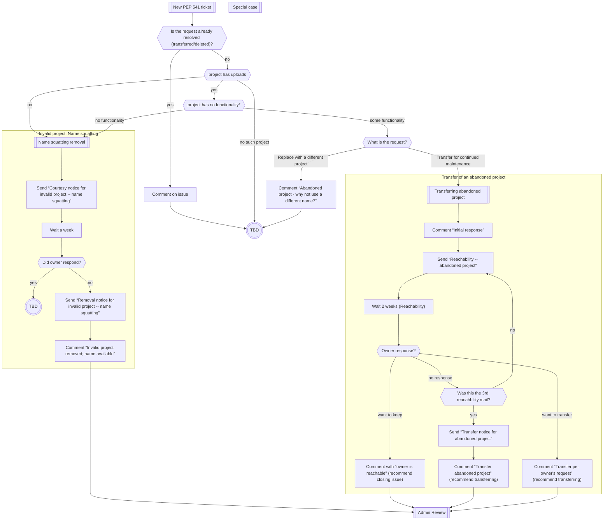

# Name Retention (PEP 541) notes

These are notes for PyPI support volunteers handling [PEP 541] project name
requests.

[PEP 541]: https://peps.python.org/pep-0541/

## Diagram

This is incomplete and doesn't account for special cases.
From anywhere in the flow, if the process feels wrong: move to *Special case* and consult with colleagues or PyPI admins.

## Email templates

### Reachability -- abandoned project

    To: $PYPI_USER_ADDRESS, $PROJECT_AUTHOR_ADDRESS, $UPLOADER_ADDRESS, $ADDRESS_FROM_DOCS
    Subject: ACTION REQUIRED: PyPI $PROJECT name retention

    Hello $NAME,

    Your project $PROJECT at $PYPI_URL appears to be abandoned, and $CANDIDATE
    has requested {transferring ownership to them in order to continue
    maintaining it|to reuse the name for another project}.
    See $SUPPORT_ISSUE_URL for details.

    As per the package index name retention policy
    (https://peps.python.org/pep-0541/), we are writing to confirm whether you
    are reachable, and whether you want to avoid transferring the project to
    $CANDIDATE.

    If you would like to keep the project, please reply to this email.

    If you are willing to give up the project, it would help us if you do it
    yourself: go to https://pypi.org/manage/project/$PROJECT/collaboration/,
    log in, and invite $CANDIDATE as an Owner.

Add one of the following notes and the common end:

#### ... attempt #1

    (nothing to add)

#### ... attempt #2

    This is our second attempt to reach you. We tried two weeks ago.

#### ... attempt #3

    This is our third and final attempt to reach you. If you do not reply in
    two weeks, we will recommend that the PyPI Administrators transfer
    ownership of PROJECT to CANDIDATE.

#### common end

    Thank you for your time,
    PyPI Support

### Transfer notice for abandoned project

    To: $PYPI_USER_ADDRESS, $PROJECT_AUTHOR_ADDRESS, $UPLOADER_ADDRESS, $ADDRESS_FROM_DOCS
    Subject: ACTION REQUIRED: PyPI $PROJECT name retention

    Hello $NAME,

    Your project $PROJECT at $PYPI_URL appears to be abandoned, and
    $CANDIDATE has requested {transferring ownership to them in order to
    continue maintaining it|to reuse the name for another project}.
    See $SUPPORT_ISSUE_URL for details.

    We have attempted to reach you several times, and did not receive a reply.
    Per the package index name retention policy (https://peps.python.org/pep-0541/),
    we have recommended that the PyPI Administrators transfer the project to
    $CANDIDATE.

    Thank you for your time,
    PyPI Support

### Courtesy notice for invalid project -- name squatting

    To: $PYPI_USER_ADDRESS, $PROJECT_AUTHOR_ADDRESS, $UPLOADER_ADDRESS, $ADDRESS_FROM_DOCS, any additional mail we find
    Subject: ACTION REQUIRED: PyPI $PROJECT name retention

    Hello $NAME,

    Your project $PROJECT at $PYPI_URL {is empty|has no functionality}.
    Per the package index name retention policy (https://peps.python.org/pep-0541/),
    we consider such projects to be name squatting, and will remove them from
    the index.

    If you would like to release a project under this name, please do so as
    soon as possible. Otherwise, we will recommend that the PyPI Administrators
    delete it in about a week.

    Thank you for your time,
    PyPI Support

### Removal notice for invalid project -- name squatting

    To: $PYPI_USER_ADDRESS, $PROJECT_AUTHOR_ADDRESS, $UPLOADER_ADDRESS, $ADDRESS_FROM_DOCS, any additional mail we find
    Subject: Notice: PyPI $PROJECT may be removed

    Hello $NAME,

    Your project $PROJECT at $PYPI_URL {is empty|has no functionality} for an
    extended period of time. Per the package index name retention policy
    (https://peps.python.org/pep-0541/), we consider such projects to be name
    squatting.

    We have recommended that the PyPI Administrators remove the project from
    the index, making it available to be claimed by someone else.

    Thank you for your time,
    PyPI Support

## GitHub comment templates

### Initial Response - generic

    We are working to contact the {owner… etc (Please fill in as you see fit)}

    Disclaimer: We are providing support to the PyPI Administrators to validate
    this request and make a recommendation on the outcome and actions to be
    taken. Final determination will be made by the PyPI Administrators when our
    process is complete.

### Initial Response - determine reachability

    We are working to contact the owner to determine if they're reachable.

    Disclaimer: We are providing support to the PyPI Administrators to validate
    this request and make a recommendation on the outcome and actions to be
    taken. Final determination will be made by the PyPI Administrators when our
    process is complete.

### Remove invalid project; name available

    $PROJECT has been deemed invalid. Additionally, the owner {did not
    respond|did not fix the issue} in a week.
    We recommend that the PyPI Administrators delete the project and make the
    name available for registration.

### Owner is reachable

    $OWNER responded to our email, indicating that they want to keep the project.
    Projects are not transferred against the wishes of a reachable owner.
    We recommend that the PyPI Administrators close the issue.

### Transfer per owner's request

    $OWNER responded to our email and said we should transfer the project,
    so we recommend that the PyPI Administrators assign $CANDIDATE as the new
    owner of $PROJECT.

### Transfer abandoned project

    We could not reach $OWNER, and we consider the project abandoned per
    [PEP 541](https://peps.python.org/pep-0541/#abandoned-projects).
    We recommend that the PyPI Administrators assign $CANDIDATE as the new
    owner of $PROJECT.

### Abandoned project - why not use a different name?

    Per PEP-541: *Projects are never removed from the Package Index solely on
    the basis of abandonment. Artifacts uploaded to the Package Index hold
    inherent historical value.*

    One of the [requirements for removal of an abandoned
    project][pep-removal-abandoned] is:

    * the candidate is able to demonstrate why a fork under a different name
      is not an acceptable workaround

    If you have a new project, why can you not use a different name for it?

    [pep-removal-abandoned]: https://peps.python.org/pep-0541/#removal-of-an-abandoned-project

